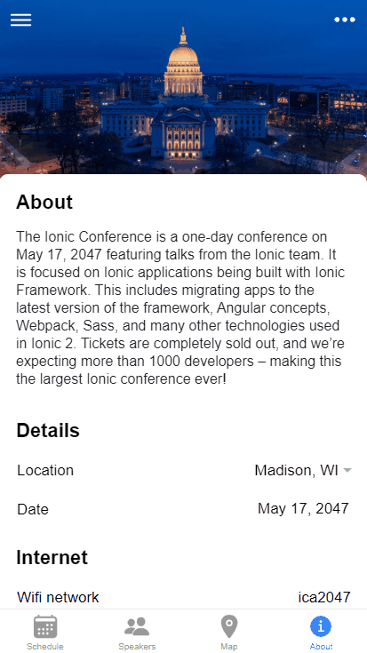

<h1 align="center">Ionic Theme Switcher</h1>
<h4>A simple custom switch theme colors directive in Ionic 5 with Angular. Change all colors of the theme with one click.</h4>



 <h2>Install</h2>
 
```
npm install ionic-theme-switcher --save

```
<h2>How To Use</h2>

- Import IonicThemeSwitcherModule in your app.module.ts or page.module.ts.
```
import {IonicThemeSwitcherModule } from 'ionic-theme-switcher';
```
```
@NgModule({
  imports: [
      ...,
      IonicThemeSwitcherModule,
      ...
  ]
})
```

**Example**

 - Define colors in your page.ts.
```
 @Component({
  selector: 'app-page',
})
export class AppPage {
  ...
  darkColors: any = {
    primary: '#8CBA80',
    secondary: '#FCFF6C',
    tertiary: '#FE5F55',
    medium: '#BCC2C7',
    dark: '#F7F7FF',
    light: '#495867',
    success: "10dc60",
    warning: "ffce00",
    danger: "f04141",
  }
  ...
}

```
 - Add directive and colors in your Ionic component.
```
 <ion-button themeSwitcher [colors]="darkColors">Switch</ion-button>
```
- **themeSwitcher** is the name of directive. Add this directive to any element on click of which you wanted to switch theme colors.

<h2>Input Options</h2>

Properties | Description | Possible Values
---|---|---
colors (Optional)| SwitchThemeModel object with properties string | SwitchThemeModel() e.g. { primary: '#0080ff', secondary: '#0cd1e8', tertiary: '#7044ff', ... }
store (Optional)| Boolean to store the theme colors in storage. Default is false. | boolean e.g. [store]="true"

<h2>References</h2>

* https://ionicframework.com/docs - Ionic


